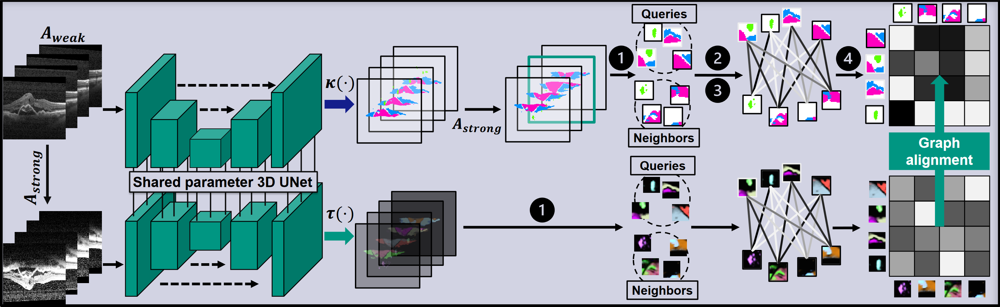

# Con2R
A repository containing the code for the paper "Graph-constrained Contrastive Regularization for Semi-weakly Volumetric Segmentation".



Specifically, we provide the loss implementation of the Con2R-loss, which can be used to train volume-processing segmentation networks with sparesely labeled volumes.

The loss computation includes:

(1) Sampling query and neighborhood sets of voxel-embeddings

(2) Computing positional coherence constraints

(3) Computing semantic similarity constraints

(4) Setting up the target graph and backpropagating the error in graph alignment

For a detailed description of the loss function and results for volumetric retinal fluid- and brain tumor segmentation, please refer to the paper and associated supplemental materials.

# Cite
```latex
@inproceedings{reiss2022graph,
  title={Graph-constrained Contrastive Regularization for Semi-weakly Volumetric Segmentation},
  author={Rei{\ss}, Simon and Seibold, Constantin and Freytag, Alexander and Rodner, Erik and Stiefelhagen, Rainer},
  booktitle={European conference on computer vision},
  year={2022},
  organization={Springer}
}
